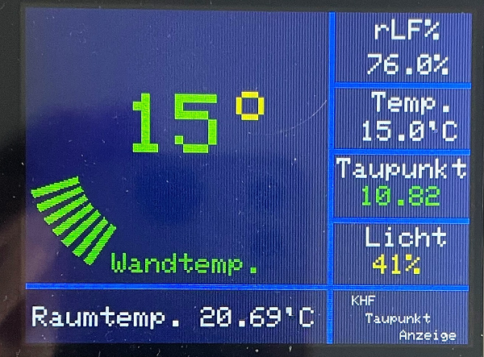
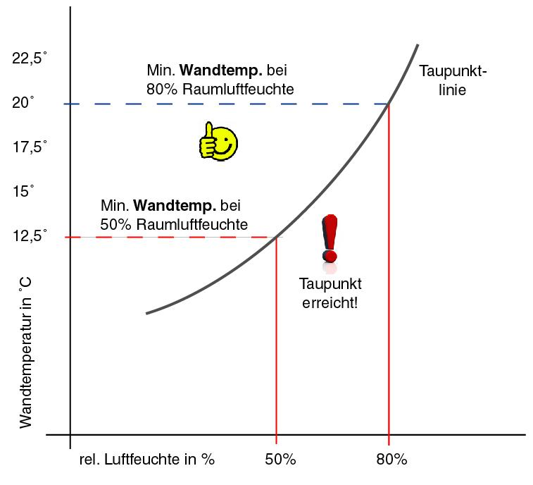

  |[:skull:ISSUE](https://github.com/frankyhub/Taupunktanzeige/issues?q=is%3Aissue)|[:speech_balloon: Forum /Discussion](https://github.com/frankyhub/Taupunktanzeige/discussions)|[:grey_question:WiKi](https://github.com/frankyhub/Taupunktanzeige/wiki)|
|--|--|--|
| | | |
||||
| <a href="https://github.com/frankyhub/Taupunktanzeige/pulse" alt="Activity">| <a href="https://github.com/frankyhub/Taupunktanzeige/graphs/traffic">  |<a href="https://github.com/frankyhub?tab=stars"> |

# Taupunktanzeige
ESP32, TFT2.8, DHT11, DS18b20, LDR

---

   
<ol class="breadcrumb" style="border-top: 2px solid black;border-bottom:2px solid black; height: 45px; width: 900px;"> 
<a href="#oben">nach oben</a>
</ol>

  

---
